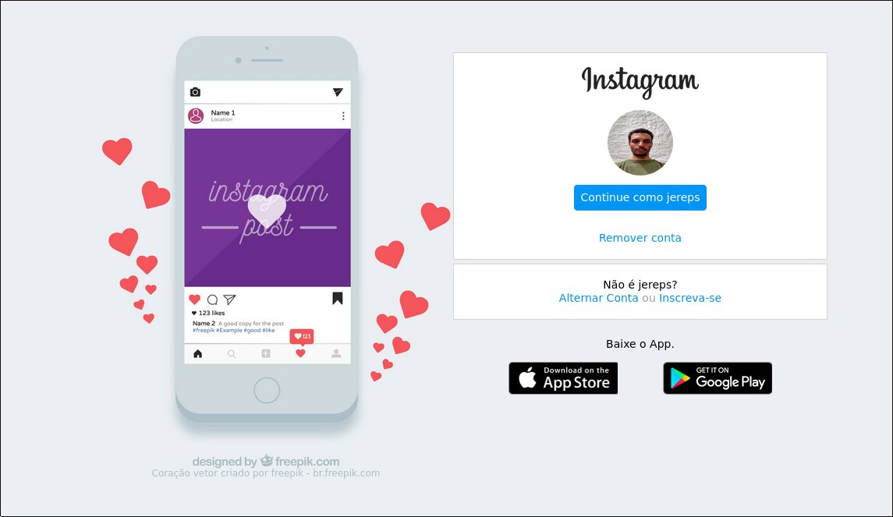
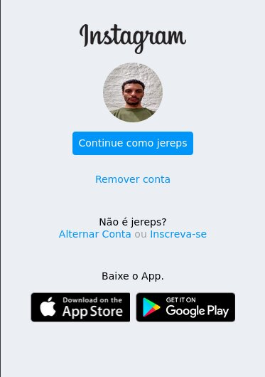

## Bootcamp Everis FullStack Developer da [Digital Innovation One](https://digitalinnovation.one)

---

> Projeto: Recriando a página inicial do Instagram

Projeto de página de login do Instragram: Nesse Projeto, foi abordado o conceito sobre CSS Flexbox.

- alterado cor de fundo para combinar com a imagem.
- alterado tamanho da imagem do profile.
- cor de fundo para tamanho de celular continua o mesmo.
- alerado cor dos groups para combinar com a cor de fundo.
- colocado atribuição da imagem utilizada para celular

